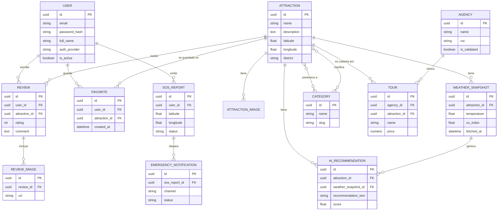

# Modelo de Dominio y Capa de Datos — MVP Backend
## Ika Travel & Experience

**Alcance de esta iteración (MVP):** Auth/Usuarios, Catálogo (Atractivos + Agencias), Clima/IA, SOS, Reseñas/Favoritos.
**Fuera de alcance por ahora:** Login biométrico, módulo de Traducción (se retoman en iteración 2).

---

## 1. Módulo: Auth & Usuarios (`users`)

### 1.1 Entidades (SQLAlchemy)

**`User`**
| Campo | Tipo | Notas |
|---|---|---|
| `id` | UUID (PK) | |
| `email` | String, unique, indexed | |
| `password_hash` | String, nullable | Null si el usuario entró solo por OAuth |
| `full_name` | String | |
| `phone` | String, nullable | Útil para notificaciones SOS |
| `auth_provider` | Enum(`email`, `google`, `facebook`) | |
| `provider_id` | String, nullable | ID externo del proveedor OAuth |
| `is_active` | Boolean, default `True` | |
| `created_at` / `updated_at` | DateTime | |

**Relaciones:**
- `User` 1:N `Review`
- `User` 1:N `Favorite`
- `User` 1:N `SOSReport`

### 1.2 DTOs (Pydantic)

- `UserCreate` (entrada registro): `email`, `password`, `full_name`
- `UserLogin` (entrada login): `email`, `password`
- `UserSocialLogin` (entrada OAuth): `provider`, `access_token`
- `UserResponse` (salida): `id`, `email`, `full_name`, `phone`, `created_at` (**nunca** exponer `password_hash`)
- `TokenResponse` (salida login): `access_token`, `token_type`, `expires_in`

### 1.3 Capa de Servicio (`service.py`)

1. `register_user(db, data: UserCreate) -> User` — valida email único, hashea password, persiste.
2. `authenticate_user(db, email, password) -> User` — valida credenciales, retorna usuario o lanza excepción.
3. `authenticate_oauth(db, provider, access_token) -> User` — verifica token con el proveedor, hace *find-or-create*.

### 1.4 Excepciones Personalizadas

- `UserAlreadyExistsException` — email duplicado en registro.
- `InvalidCredentialsException` — password incorrecto o usuario no encontrado en login.
- `InactiveUserException` — usuario desactivado intenta autenticarse.

---

## 2. Módulo: Catálogo — Atractivos (`catalog`)

### 2.1 Entidades (SQLAlchemy)

**`Category`**
| Campo | Tipo | Notas |
|---|---|---|
| `id` | UUID (PK) | |
| `name` | String, unique | Ej. "Sandboarding", "Cultural" |
| `slug` | String, unique | |

**`Attraction`**
| Campo | Tipo | Notas |
|---|---|---|
| `id` | UUID (PK) | |
| `name` | String | |
| `description` | Text | |
| `latitude` / `longitude` | Float | Usado por módulo `geo` |
| `district` | String | |
| `official_recommendation` | Text, nullable | Recomendación oficial (RF-02) |
| `created_at` / `updated_at` | DateTime | |

**`AttractionImage`**
| Campo | Tipo | Notas |
|---|---|---|
| `id` | UUID (PK) | |
| `attraction_id` | UUID (FK → Attraction) | |
| `url` | String | |
| `display_order` | Integer | |

**`AttractionCategory`** (tabla puente N:M)
| Campo | Tipo |
|---|---|
| `attraction_id` | UUID (FK) |
| `category_id` | UUID (FK) |

**Relaciones:**
- `Attraction` N:M `Category` (una atracción puede ser "Aventura" + "Sandboarding")
- `Attraction` 1:N `AttractionImage`
- `Attraction` 1:N `Review`
- `Attraction` N:M `User` (a través de `Favorite`)

### 2.2 DTOs (Pydantic)

- `AttractionCreate` / `AttractionUpdate` (uso administrativo/interno, no público en MVP)
- `AttractionListItem` (salida resumida para listado): `id`, `name`, `district`, `cover_image_url`, `category_names`
- `AttractionDetailResponse` (salida detalle): incluye `description`, `official_recommendation`, `images: List[str]`, `categories: List[str]`, `avg_rating`
- `CategoryResponse`: `id`, `name`, `slug`

### 2.3 Capa de Servicio

1. `get_paginated_attractions(db, filters, page, size) -> List[Attraction]` — filtros por categoría/distrito.
2. `get_attraction_detail(db, attraction_id) -> Attraction` — incluye cálculo de `avg_rating` agregando `Review`.
3. `list_categories(db) -> List[Category]`

### 2.4 Excepciones Personalizadas

- `AttractionNotFoundException`
- `InvalidCategoryFilterException`

---

## 3. Módulo: Catálogo — Agencias (`catalog`)

### 3.1 Entidades (SQLAlchemy)

**`Agency`**
| Campo | Tipo | Notas |
|---|---|---|
| `id` | UUID (PK) | |
| `name` | String | |
| `ruc` | String, unique | Identificador tributario peruano |
| `dircetur_registry_number` | String, nullable | Null hasta que se valida |
| `is_validated` | Boolean, default `False` | Cumple RN-01 |
| `validated_at` | DateTime, nullable | |
| `contact_phone` / `contact_email` | String | |
| `created_at` | DateTime | |

**`Tour`**
| Campo | Tipo | Notas |
|---|---|---|
| `id` | UUID (PK) | |
| `agency_id` | UUID (FK → Agency) | |
| `attraction_id` | UUID (FK → Attraction), nullable | |
| `name` | String | |
| `description` | Text | |
| `price` | Numeric(10,2) | |
| `duration_hours` | Integer | |

**Relaciones:**
- `Agency` 1:N `Tour`
- `Tour` N:1 `Attraction` (opcional, un tour puede no atarse a una sola atracción)

### 3.2 DTOs (Pydantic)

- `AgencyListItem`: `id`, `name`, `is_validated`, `tour_count`
- `AgencyDetailResponse`: incluye `tours: List[TourResponse]`
- `TourResponse`: `id`, `name`, `price`, `duration_hours`, `attraction_name`

### 3.3 Capa de Servicio

1. `search_agencies(db, query, location) -> List[Agency]` — solo retorna `is_validated=True` (regla RN-01 aplicada en la capa de servicio, no solo en el endpoint).
2. `get_agency_with_tours(db, agency_id) -> Agency`
3. `sync_dircetur_registry()` — llamada por la tarea Celery, actualiza `is_validated` y `dircetur_registry_number` contra el padrón oficial.

### 3.4 Excepciones Personalizadas

- `AgencyNotValidatedException` — se intenta exponer/reservar una agencia no validada por DIRCETUR.
- `AgencyNotFoundException`
- `DircerturSyncFailedException` — falla la sincronización externa (para manejo en la tarea Celery).

---

## 4. Módulo: Clima / IA (`weather`)

### 4.1 Entidades (SQLAlchemy)

**`WeatherSnapshot`**
| Campo | Tipo | Notas |
|---|---|---|
| `id` | UUID (PK) | |
| `attraction_id` | UUID (FK → Attraction), nullable | Null = pronóstico general de la región |
| `temperature` | Float | |
| `uv_index` | Float | |
| `wind_speed` | Float | |
| `humidity` | Float | |
| `condition` | String | Ej. "Soleado", "Nublado" |
| `fetched_at` | DateTime, indexed | Clave para cumplir RN-03 (máx. 6h de antigüedad) |
| `source` | String | API meteorológica usada |

**`WeatherAlert`**
| Campo | Tipo | Notas |
|---|---|---|
| `id` | UUID (PK) | |
| `zone` | String | |
| `severity` | Enum(`low`, `medium`, `high`) | |
| `message` | Text | |
| `starts_at` / `ends_at` | DateTime | |

**`AIRecommendation`**
| Campo | Tipo | Notas |
|---|---|---|
| `id` | UUID (PK) | |
| `attraction_id` | UUID (FK → Attraction) | |
| `weather_snapshot_id` | UUID (FK → WeatherSnapshot) | |
| `recommendation_text` | String | Ej. "Excelente para Sandboarding" |
| `score` | Float | 0–1, usado para ordenar recomendaciones |
| `generated_at` | DateTime | |

**Relaciones:**
- `Attraction` 1:N `WeatherSnapshot`
- `Attraction` 1:N `AIRecommendation`
- `WeatherSnapshot` 1:N `AIRecommendation`

### 4.2 DTOs (Pydantic)

- `WeatherCurrentResponse`: `temperature`, `uv_index`, `wind_speed`, `condition`, `fetched_at`
- `WeatherForecastResponse`: `List[WeatherCurrentResponse]` por día/hora
- `WeatherAlertResponse`: `zone`, `severity`, `message`, `starts_at`, `ends_at`
- `AIRecommendationResponse`: `attraction_id`, `recommendation_text`, `score`

### 4.3 Capa de Servicio

1. `get_fresh_snapshot(db, attraction_id | location) -> WeatherSnapshot` — valida antigüedad ≤6h (RN-03); si está vencida, dispara refresco síncrono o lanza excepción según criticidad.
2. `generate_ai_recommendation(snapshot: WeatherSnapshot, attraction: Attraction) -> AIRecommendation` — lógica pura de scoring (independiente del endpoint, testeable unitariamente).
3. `refresh_weather_cache()` — función invocada por Celery Beat cada ≤6h; recorre atractivos activos y actualiza `WeatherSnapshot`.

### 4.4 Excepciones Personalizadas

- `StaleWeatherDataException` — no hay datos frescos (<6h) y el refresco síncrono también falla (viola RN-03).
- `WeatherProviderUnavailableException` — la API externa de clima no responde.

---

## 5. Módulo: Emergencia / SOS (`emergency`)

### 5.1 Entidades (SQLAlchemy)

**`SOSReport`**
| Campo | Tipo | Notas |
|---|---|---|
| `id` | UUID (PK) | |
| `user_id` | UUID (FK → User) | Requiere auth (RN-02) |
| `latitude` / `longitude` | Float | Obligatorio, valida permisos GPS (RN-04) |
| `description` | Text, nullable | |
| `status` | Enum(`pending`, `dispatched`, `resolved`) | default `pending` |
| `created_at` | DateTime | |
| `resolved_at` | DateTime, nullable | |

**`EmergencyNotification`**
| Campo | Tipo | Notas |
|---|---|---|
| `id` | UUID (PK) | |
| `sos_report_id` | UUID (FK → SOSReport) | |
| `channel` | Enum(`sms`, `email`, `push`) | |
| `recipient` | String | |
| `sent_at` | DateTime, nullable | |
| `status` | Enum(`queued`, `sent`, `failed`) | |

**Relaciones:**
- `User` 1:N `SOSReport`
- `SOSReport` 1:N `EmergencyNotification`

### 5.2 DTOs (Pydantic)

- `SOSCreate` (entrada): `latitude`, `longitude`, `description` (opcional)
- `SOSResponse` (salida): `id`, `status`, `created_at`
- `SOSStatusResponse`: `id`, `status`, `resolved_at`
- `IncidentHistoryItem`: `id`, `status`, `created_at`, `latitude`, `longitude`

### 5.3 Capa de Servicio

1. `create_sos_report(db, user_id, data: SOSCreate) -> SOSReport` — valida coordenadas no nulas (RN-04), persiste, encola notificación Celery.
2. `get_user_incidents(db, user_id) -> List[SOSReport]`
3. `resolve_sos_report(db, report_id) -> SOSReport` — uso interno/admin.

### 5.4 Excepciones Personalizadas

- `MissingLocationPermissionException` — coordenadas ausentes/inválidas (viola RN-04).
- `SOSReportNotFoundException`
- `UnauthorizedIncidentAccessException` — un usuario intenta ver el reporte de otro.

---

## 6. Módulo: Reseñas y Favoritos (`reviews`)

### 6.1 Entidades (SQLAlchemy)

**`Review`**
| Campo | Tipo | Notas |
|---|---|---|
| `id` | UUID (PK) | |
| `user_id` | UUID (FK → User) | |
| `attraction_id` | UUID (FK → Attraction) | |
| `rating` | Integer | Check constraint 1–5 |
| `comment` | Text, nullable | |
| `created_at` | DateTime | |

**`ReviewImage`**
| Campo | Tipo | Notas |
|---|---|---|
| `id` | UUID (PK) | |
| `review_id` | UUID (FK → Review) | |
| `url` | String | |

**`Favorite`** (entidad asociativa N:M con dato propio)
| Campo | Tipo | Notas |
|---|---|---|
| `id` | UUID (PK) | |
| `user_id` | UUID (FK → User) | |
| `attraction_id` | UUID (FK → Attraction) | |
| `created_at` | DateTime | |
| — | Unique constraint (`user_id`, `attraction_id`) | Evita duplicados |

**Relaciones:**
- `User` 1:N `Review`, `Attraction` 1:N `Review`
- `Review` 1:N `ReviewImage`
- `User` N:M `Attraction` a través de `Favorite`

### 6.2 DTOs (Pydantic)

- `ReviewCreate` (entrada): `attraction_id`, `rating`, `comment`, `image_urls: List[str]`
- `ReviewResponse` (salida): `id`, `user_name`, `rating`, `comment`, `images`, `created_at`
- `FavoriteResponse`: `attraction_id`, `attraction_name`, `cover_image_url`, `created_at`

### 6.3 Capa de Servicio

1. `create_review(db, user_id, data: ReviewCreate) -> Review` — valida que el usuario no reseñe la misma atracción dos veces (regla de negocio a confirmar con el equipo).
2. `toggle_favorite(db, user_id, attraction_id) -> bool` — agrega o quita según exista el registro.
3. `calculate_average_rating(attraction_id) -> float` — lógica pura reutilizada por `catalog.get_attraction_detail`.

### 6.4 Excepciones Personalizadas

- `DuplicateReviewException`
- `InvalidRatingException` — rating fuera de rango 1–5.
- `FavoriteNotFoundException` — intento de eliminar un favorito inexistente.

---

## 7. Diagrama Entidad-Relación (Mermaid)

---

## Notas para el equipo antes de programar

1. **Orden de implementación sugerido:** `User` → `Attraction`/`Category` → `Agency`/`Tour` → `WeatherSnapshot` → `SOSReport` → `Review`/`Favorite`. Este orden respeta las dependencias de FK (no puedes crear `Review` sin que `User` y `Attraction` existan primero en la migración de Alembic).
2. **RN-01 (agencias formales)** se aplica en la capa de servicio (`search_agencies` filtra `is_validated=True`), no solo como filtro opcional en el endpoint — así ningún desarrollador puede "olvidarlo" al construir un nuevo endpoint sobre `Agency`.
3. **RN-03 (frescura del clima)** vive en `get_fresh_snapshot()`, no en el router — cualquier módulo que necesite clima (incluyendo un futuro módulo de itinerarios) reutiliza esta validación centralizada.
4. Las excepciones personalizadas deben mapearse a códigos HTTP en `core/exceptions.py` mediante handlers globales (`@app.exception_handler(...)`), no con `HTTPException` repetido en cada router.
